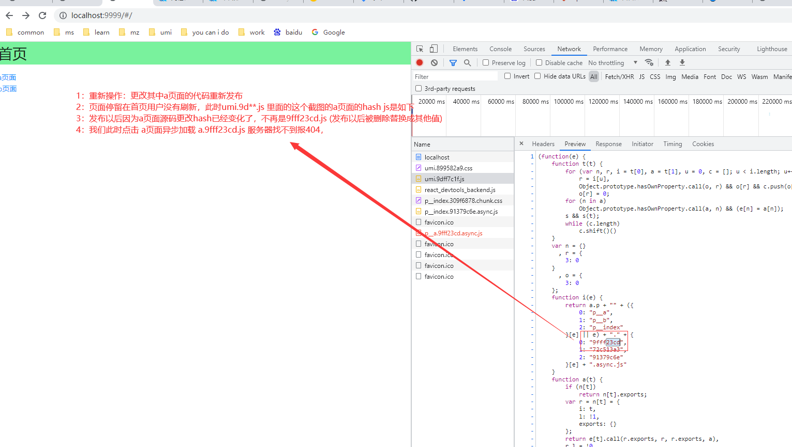
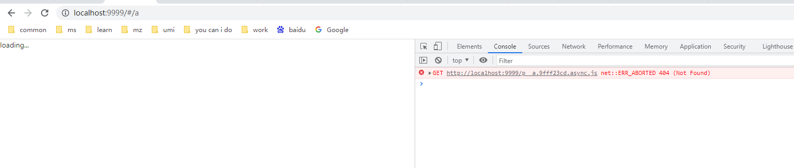
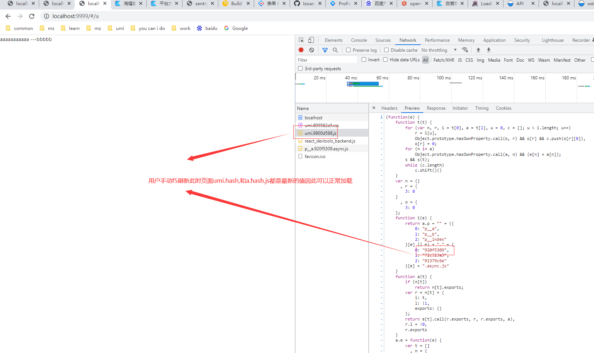
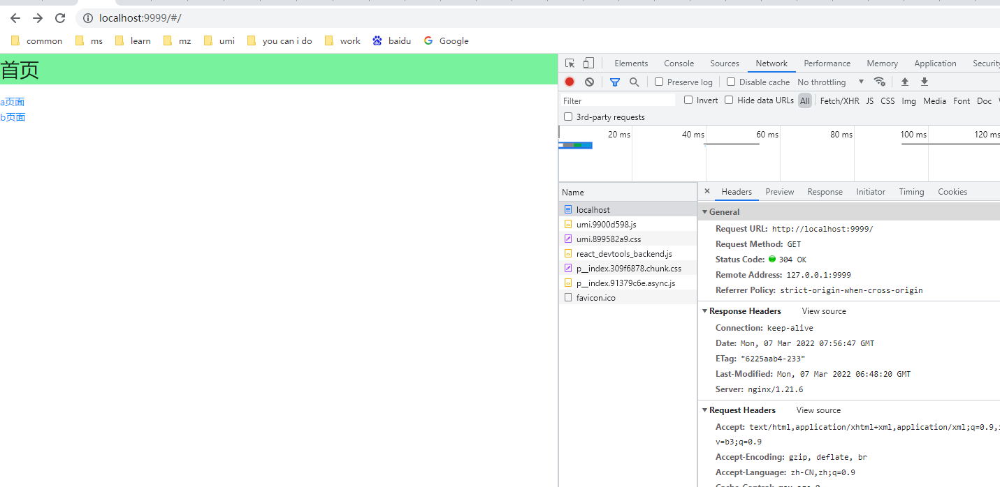
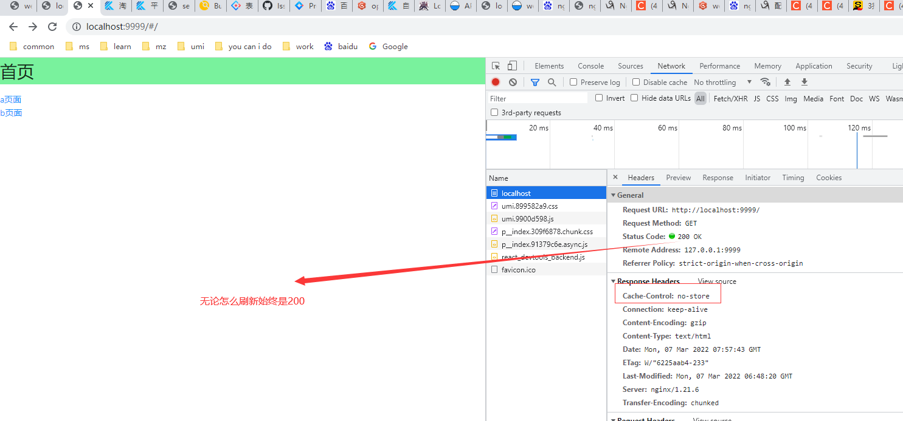
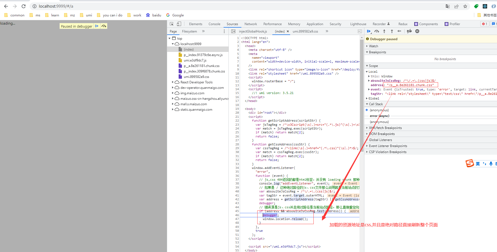
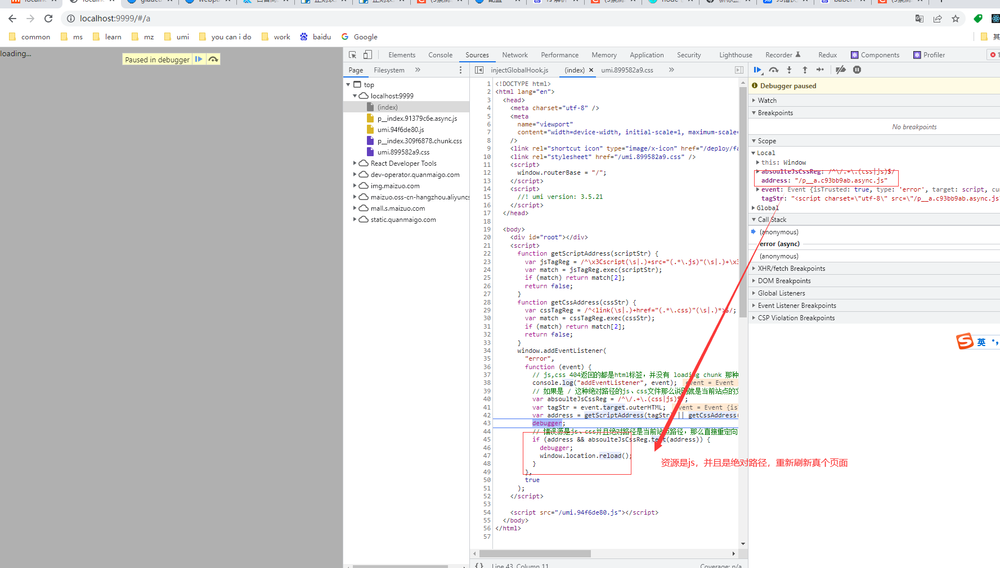
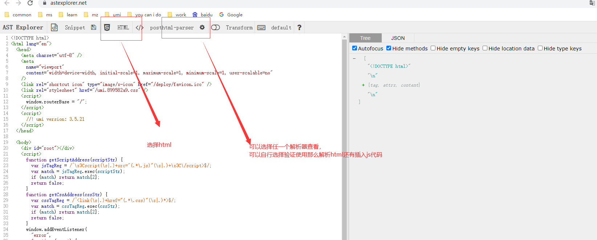
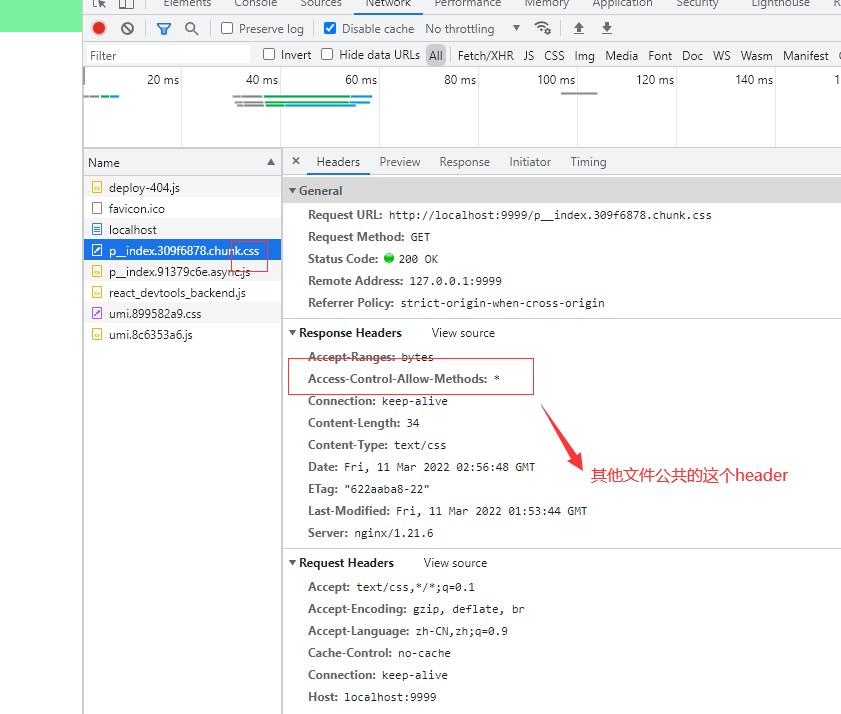
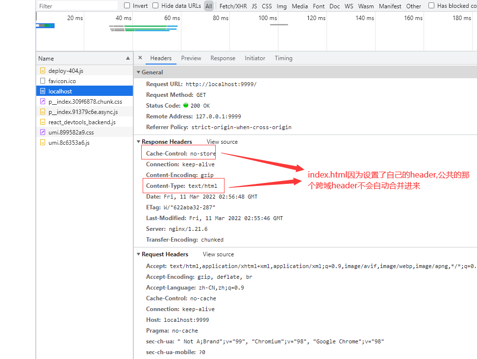

# web-nginx-test

学习nginx、docker的使用，验证一些之前遇到过的问题

工具依赖

docker、docker-compose

请先 [安装docker](https://www.docker.com/get-started)

## 常用命令

1: 初始化

`yarn`

<!-- zx全局安装，发布使用了该命令工具 -->
`yarn global add zx`

<!-- terser全局安装，压缩404.js使用 -->
`yarn global add terser`


2：本地开发

`yarn start`

访问 http://localhost:8000

[本地文档](http://localhost:8000/#/~docs)

3: 发布

构建前端代码，并且使用docker启动服务

`yarn build`

访问 http://localhost:9999

如果只是更改了nginx配置，不需要重新构建dist源码，执行 `yarn deploy`即可

## 背景

[参考Loading chunk {n} failed](https://www.pengsifan.com/2020/12/01/Loading%20chunk%20%7Bn%7D%20failed/)

本地模拟

切换到 `404` 分支，按如下图操作即可复现该问题







> 如果之前的 a页面浏览器已经加载过了，那么即使命中的是旧的hash地址，此时页面也不会404，因为命中了浏览器的强缓存 （基于这种用户加载过命中强缓存，并且没有刷新，页面加载旧代码的情况又如何折中处理获取最新代码？也值得思考，强制对所有js、css文件新增 no-cache？建议大家可以自行测试验证下）

结合上面的参考文档分析，以及其他百度分析，处理如下

1：nginx配置

对 index.html 新增响应头

```js
Cache-Control "no-cache";
```

新增改响应头以后，默认index.html文件始终会请求服务器，进行协商缓存，[nginx etag生成规则](https://www.ipcpu.com/2019/09/nginx-etag-gzip/)，每次发布以后index.html文件的修改时间变了，etag也变了，不会命中304缓存


2：路由拦截新增404跳转等

cra项目，代码在淘福客运营商系统有

```js
import { lazy } from "react";

function retry(fn) {
  return new Promise((resolve, reject) => {
    fn()
      .then(resolve)
      .catch((error) => {
        const pattern = /Loading (CSS )?chunk (\d)+ failed/g;
        const isChunkLoadFailed = error.message.match(pattern);
        if (isChunkLoadFailed) {
          window.location.reload();
        }
        reject(error);
      });
  });
}

/**
 * react lazy包装器
 * @param {*} pagePath 页面路径
 * @param {*} prefix 页面路径前缀，对应文件夹最初的前缀、模式是 /operator 大部分页面都是在这个文件夹下
 */
export default function Loadable(pagePath, prefix = "/operator") {
  return lazy(() => retry(() => import(`../view${prefix}${pagePath}`)));
}

```

出现 isChunkLoadFailed error的时候直接 reload整个页面解决


<Alert type="info">
目前大部分详情新增该处理后，自行验证可以解决该问题，但是部分情况，比如商品中心这个项目，有的用户电脑偶发的出现 index.html 直接 命中了 200 强缓存；
并且路由拦截的404好像也没有触发；自己测试没有出现过，因此不清楚具体还有那里会影响这个缓存 （商品中心已废弃，重构了新版本）
</Alert>

基于上面的情况提出而下二点优化

- index.html 的 no-cache 改成 no-store，看能不能避免商品中心项目还命中200强缓存
- 404处理放到服务层统一处理，业务层不再处理这种情况，业务层无感知，不需要额外新增代码

## 本地测试方案

为了尽可能的模拟整个情况

线上的环境都是基于k8s的，每次发布生成不同的镜像，推送镜像到公司远程镜像库，并直接 apply deployment.yaml 文件 （每次更新基本只是更改镜像地址）

我们本地开发测试，如果借助公司环境的k8s，会产生很多垃圾镜像数据，如果自己电脑搭建k8s服务会比较麻烦，镜像拉取那些，之前试过搭建很多次才拉取成功，并且对电脑要求更高点

基于我们基本都安装了docker，因此可以退而直接使用 docker，整体上存在的差异性应该不大

docker 思路，同之前的发布一样

### 1：生成构建dist源文件

> umi build命令因为我们的发布目录都放在了deploy，因此把dist目录构建到 ./deploy/dist

### 2：nginx静态目录托管

```js
// deploy/nginx.conf
user root;
worker_processes 1;

events {
	worker_connections 1024;
}

http {
	include       /etc/nginx/mime.types;
	default_type  application/octet-stream;

	log_format  main  '$remote_addr - $remote_user [$time_local] "$request" '
										'$status $request_time $http_host $body_bytes_sent "$http_referer" '
										'"$http_user_agent" "$http_x_forwarded_for"';

	access_log  /var/log/nginx/access.log  main;

	client_max_body_size 2m;
	sendfile            on;
	tcp_nopush          on;
	tcp_nodelay         on;
	keepalive_timeout   65;
	types_hash_max_size 2048;

	gzip on;
	gzip_min_length    256;
	gzip_types
			application/atom+xml
			application/javascript
			application/json
			application/ld+json
			application/manifest+json
			application/rdf+xml
			application/rss+xml
			application/schema+json
			application/vnd.geo+json
			application/vnd.ms-fontobject
			application/x-font-ttf
			application/x-javascript
			application/x-web-app-manifest+json
			application/xhtml+xml
			application/xml
			font/eot
			font/opentype
			image/bmp
			image/svg+xml
			image/vnd.microsoft.icon
			image/x-icon
			text/cache-manifest
			text/css
			text/javascript
			text/plain
			text/vcard
			text/vnd.rim.location.xloc
			text/vtt
			text/x-component
			text/x-cross-domain-policy
			text/xml;

	server {
		listen 80;
		server_name default;

    root /web/nginx-test;
    index index.html;


    location / {
      try_files $uri $uri/ /index.html;
    }

    location ~* ^.+\.(jpg|jpeg|gif|png|bmp|css|js|swf)$ {
        access_log off;
    }
	}
}
```

### 3. 定义 Dockerfile文件，加载nginx服务

```js
// deploy/Dockerfile
FROM nginx

# 创建工作目录
RUN mkdir -p /web/nginx-test

# 设置工作目录
WORKDIR /web/nginx-test

# copy 打包之后的资源到工作区
COPY ./dist /web/nginx-test

ADD ./nginx.conf /etc/nginx/nginx.conf

EXPOSE 80
```

然后整理的流程是 build - build镜像 - 启动容器

如果使用 docker run 命令跑容器，当我们每次需要更新源码或者是nginx配置时，我们都需要 stop 停止容器后重新跑同一个服务端口，因此我们借助 docker-compose更改方便的去管理 容器的重启动

### 4. docker-compose.yaml
```js
// deploy/docker-compose.yaml
version: "3.4"

services:
  web:
    build: .
    ports:
      - "127.0.0.1:9999:80"
    environment:
      TZ: Asia/Shanghai
volumes:
  nginx-test:
```

核心命令 `docker-compose up -d --build`

> docker-compose 里面加了build参数，这样源码更新容器才能更新到最新的源码，但是会带来更多的垃圾镜像，我们可以手动清理，

也可以考虑每次直接清除

> Found orphan containers (deploy_web1_1) for this project. If you removed or renamed this service in your compose file, you can run this command with the --remove-orphans flag to clean it up.

基于 zx 文档参考在下面，我们对这二步直接封装下

```js
// deploy/deploy.mjs
#!/usr/bin/env zx

// 进入发布目录
cd('./deploy');

// docker-compose构建镜像启动容器，(-d:后台运行,--build：每次都重新构建镜像，必须加不加的话dist源码更新容器里面跑的镜像还是旧的导致代码没更新)
await $`docker-compose up -d --build`;

console.log(chalk.green('发布成功！！！！！'));

// 上一步每一次都是执行up都是创建新的镜像，新镜像的名字一直是 deploy_web_1,导致原来的deploy_web_1被覆盖，旧的deploy_web_1镜像被重命名为一个"none"的镜像 （源码更改才会产生，源码没更改不会生成新的镜像）

// 等待10s后
await $`sleep 10`;

console.log(chalk.cyan('开始删除多余的none镜像'));

// 删除none历史旧镜像，源代码没有更改不会产生新的镜像，没有none镜像会抛出异常，因此用nothrow包裹
await nothrow($`docker rmi $(docker images | grep "none" | awk '{print $3}')`);

```

## 改进

### nginx index.html配置

新增响应头

```js
location / {
  if ($request_filename ~* ^.*[.](html|htm)$) {
    add_header Cache-Control "no-store";
  }
  try_files $uri $uri/ /index.html;
}
```

效果对比






### 404 处理

之前最初想要在nginx拦截到404然后自定义404页面进行响应，然后因为我们这个是js、css静态文件的404，即使配置了404也是呈现在network 请求里面，并不会反应到页面上，尝试使用node 起web服务也是同一个原因，导致这条路走不通

思考

- websocket 连接处理 这种肯定可以处理，就是额外增加很多监听，也很麻烦，因此第一印象放弃了
- 入口文件捕获到这些错误，如果是jss、css文件的加载错误直接进行reload

最终决定使用第二种方式

首先我们得知道[捕获错误](https://zhuanlan.zhihu.com/p/123286696)

> 注意 window.onerror不能捕获静态资源的错误

最终调试形成了以下代码

```js
// 在index.html下新增该代码即可 （会考虑自动把这段代码写进去）
<script>
  function getScriptAddress (scriptStr) {
    var jsTagReg = /^\x3Cscript(\s|.)+src="(.*\.js)"(\s|.)+\x3C\/script>$/
    var match = jsTagReg.exec(scriptStr)
    if (match) return match[2]
    return false
  }
  function getCssAddress (cssStr) {
    var cssTagReg = /^<link(\s|.)+href="(.*\.css)"(\s|.)*>$/
    var match = cssTagReg.exec(cssStr)
    if (match) return match[2]
    return false
  }
  window.addEventListener('error', function(event) {
    // js,css 404返回的都是html标签，并没有 loading chunk 那种error抛出，那个error在import有抛出
    console.log('addEventListener', event)
    // 如果是 / 这种绝对路径的js、css文件那么说明就是当前站点的文件
    var absoulteJsCssReg = /^\/.+\.(css|js)$/
    var tagStr = event.target.outerHTML
    var address = getScriptAddress(tagStr) || getCssAddress(tagStr)
    debugger
    // 错误源是js、css并且绝对路径是当前站点路径，那么直接重定向，文件 404问题
    if (address && absoulteJsCssReg.test(address)) {
      debugger
      window.location.reload()
    }
  }, true);
</script>
```

思路：

1：addEventListener error监听静态资源错误

2：正则匹配错误的outHtml，获取js、css 的地址

3: 获取到js、css地址并且判断该地址是绝对路径，绝对路径reload整个页面

> 其他路径不要reload整个页面，因为可能存在站点加载其他域资源文件的情况

> 资源的错误没有抛出 loading chunk 那种error抛出，那个error在路由懒加载lazy的时候可以拿到，但是监听的error拿不到，因此我们加了些判断

调试截图如下





### 404脚本插入

上面的404处理写的时候是写在模板里面验证的，是写在业务方的，为了不再业务方插入那个js代码，我们考虑解析注入的方式

fs读取虽然可以拼接但是不是很优雅，参考 [ast](https://astexplorer.net/)


转译介绍等 [转译器原理 parser 篇](https://juejin.cn/post/6959502530745204772#heading-3)




最终选用了posthtml库，里面有现成的插件[posthtml-insert-at](https://github.com/posthtml/posthtml-insert-at)

1：抽离原先的404处理js代码

```js
// ./deploy/deploy.404.js
function getScriptAddress(scriptStr) {
  var jsTagReg = /^\x3Cscript(\s|.)+src="(.*\.js)"(\s|.)+\x3C\/script>$/;
  var match = jsTagReg.exec(scriptStr);
  if (match) return match[2];
  return false;
}

function getCssAddress(cssStr) {
  var cssTagReg = /^<link(\s|.)+href="(.*\.css)"(\s|.)*>$/;
  var match = cssTagReg.exec(cssStr);
  if (match) return match[2];
  return false;
}

window.addEventListener(
  'error',
  function (event) {
    // js,css 404返回的都是html标签，并没有 loading chunk 那种error抛出，那个error在import有抛出
    console.log('addEventListener', event);
    // 如果是 / 这种绝对路径的js、css文件那么说明就是当前站点的文件
    var absoulteJsCssReg = /^\/.+\.(css|js)$/;
    var tagStr = event.target.outerHTML;
    var address = getScriptAddress(tagStr) || getCssAddress(tagStr);
    debugger;
    // 错误源是js、css并且绝对路径是当前站点路径，那么直接重定向，文件 404问题
    if (address && absoulteJsCssReg.test(address)) {
      debugger;
      window.location.reload();
    }
  },
  true,
);

```

2：前端静态资源构建完成以后，启动docker-compose之前插入外链404js

```js
// deploy.mjs
console.log(chalk.cyan('404处理插入到index.html中'));

// 把404这个js处理文件插入到index.html的head标签里面
await $`zx html.mjs`;

console.log(
  chalk.green('404js外链插入成功，后续dockerfile会把该文件copy到工作区'),
);

```

```js
// deploy/html.mjs
#!/usr/bin/env zx

const posthtml = require('posthtml');
const { insertAt } = require('posthtml-insert-at');

const indexPath = path.join(__dirname, './dist/index.html');

const html = await fs.readFile(path.join(__dirname, './dist/index.html'));

// https://github.com/posthtml/posthtml-insert-at
posthtml()
  .use(
    insertAt({
      selector: 'head',
      append: `
        <script src="/deploy.404.min.js"></script>
      `,
    }),
  )
  .process(html)
  .then((result) => fs.writeFileSync(indexPath, result.html));

```

2.1：频繁执行 yarn deploy可能会给html添加了多个404 js

多次直接执行yarn deploy 404标签添加多个的问题

- [parse](https://github.com/posthtml/posthtml-parser) parse判断是否已经注入，已经注入不再注入
- [posthtml-plugin-remove-duplicates](https://github.com/sithmel/posthtml-plugin-remove-duplicates) 直接移除重复标签

目前采用 插件移除重复标签

```js
// deploy/html.mjs
#!/usr/bin/env zx

const posthtml = require('posthtml');
const posthtmlPluginRemoveDuplicates = require('posthtml-plugin-remove-duplicates');
const { insertAt } = require('posthtml-insert-at');

const indexPath = path.join(__dirname, './dist/index.html');

const html = await fs.readFile(path.join(__dirname, './dist/index.html'));

posthtml()
  .use(
    // https://github.com/posthtml/posthtml-insert-at
    insertAt({
      selector: 'head',
      append: `
        <script src="/deploy.404.min.js"></script>
      `,
    }),
  )
  // https://github.com/sithmel/posthtml-plugin-remove-duplicates
  .use(posthtmlPluginRemoveDuplicates({ script: true }))
  .process(html)
  .then((result) => fs.writeFileSync(indexPath, result.html));

```

> posthtml-plugin-remove-duplicates 文件里面options.js 最新版本options.script

> 至此404问题验证完成，but之前别的偶发的后面再看能不能复现然后具体再分析，（实际那个唯一能偶发复现的项目已经废弃），后续考虑直接把该处理逻辑直接集成到现有的发布cli里面

## 其他问题

总结一些调试还有之前遇到的一些nginx docker问题等

### nginx alias

nginx alias的处理，demo模拟可切换到 `alias` 分支查看


### nginx add_header

nginx add_header，demo模拟可切换到 `header` 分支查看

nginx 的 add_header并不会智能合并，需要注意匹配了一个location，在location里面的 add_header不会合并外层的公共header作用于当前location。比如

```js
server {
  listen 80;
  server_name default;

  root /web/nginx-test;
  index index.html;

  // 公共header
  add_header Access-Control-Allow-Methods *;

  location / {
    if ($request_filename ~* ^.*[.](html|htm)$) {
      add_header Cache-Control "no-store";
    }
    try_files $uri $uri/ /index.html;
  }

  location ~* ^.+\.(jpg|jpeg|gif|png|bmp|css|js|swf)$ {
      access_log off;
  }
}
```

当文件匹配到 index.html的时候，响应头只有  Cache-Control 没有 Access-Control-Allow-Methods

如图






> 之前没有注意这个问题，导致在index.html里面加了一些 header以后丢失了外层的公共header,导致公共的跨域配置丢失

### docker

1: docker exec

`docker exec -it deploy_web_1 /bin/sh`
`docker exec -it deploy_web_1 /bin/bash`

报 ·`CI runtime exec failed: exec failed: container_linux.go:380: starting container process caused: exec: "C:/Program Files/Git/usr/bin/sh": stat C:/Program Files/Git/usr/bin/sh: no such file or directory: unknown`

可以执行试下 `docker exec -it deploy_web_1 bash`

2: docker 容器里面如何使用vi编辑器

我们进入容器里面，ls可以看到对应的目录，也可以直接vi编辑修改源码，index.html等，[docker 容器里面使用vi](https://zhuanlan.zhihu.com/p/332446790)

3：除了vi更改对应源码，我们复制本地文件到容器里面进行覆盖，也会生效

[docker cp](https://www.runoob.com/docker/docker-cp-command.html)

> 注意nginx目录是，/etc/nginx/nginx.conf 如果是vi修改或者复制文件覆盖nginx配置，需要重启下nginx生效 nginx -s reload

## 参考文档

官方文档

- [umi](https://umijs.org/zh-CN/docs) 脚手架
- [dumi](https://d.umijs.org/zh-CN) 文档工具
- [zx](https://github.com/google/zx) google命令行工具
- [docker-compose](https://docs.docker.com/compose/reference/config/) docker-compose管理
- [nginx](https://www.nginx.cn/doc/)
- [posthtml](https://github.com/posthtml)
- [ast](https://astexplorer.net/)

其他文档

- [docker-compose.yaml](https://www.jianshu.com/p/0e25ebffd197) 文件详解
- [nginx](https://juejin.cn/post/7007346707767754765) nginx整合介绍
- [浏览器缓存](https://github.com/yiliang114/Blog/issues/6)
- [安装docker](https://www.docker.com/get-started)
- [参考Loading chunk {n} failed](https://www.pengsifan.com/2020/12/01/Loading%20chunk%20%7Bn%7D%20failed/)
- [nginx etag生成规则](https://www.ipcpu.com/2019/09/nginx-etag-gzip/)
- [js错误捕获](https://zhuanlan.zhihu.com/p/123286696)
- [转译器原理 parser 篇](https://juejin.cn/post/6959502530745204772#heading-3)
- [docker 容器里面使用vi](https://zhuanlan.zhihu.com/p/332446790)
- [parse](https://github.com/posthtml/posthtml-parser) parse判断是否已经注入，已经注入不再注入
- [posthtml-plugin-remove-duplicates](https://github.com/sithmel/posthtml-plugin-remove-duplicates) 直接移除重复标签


